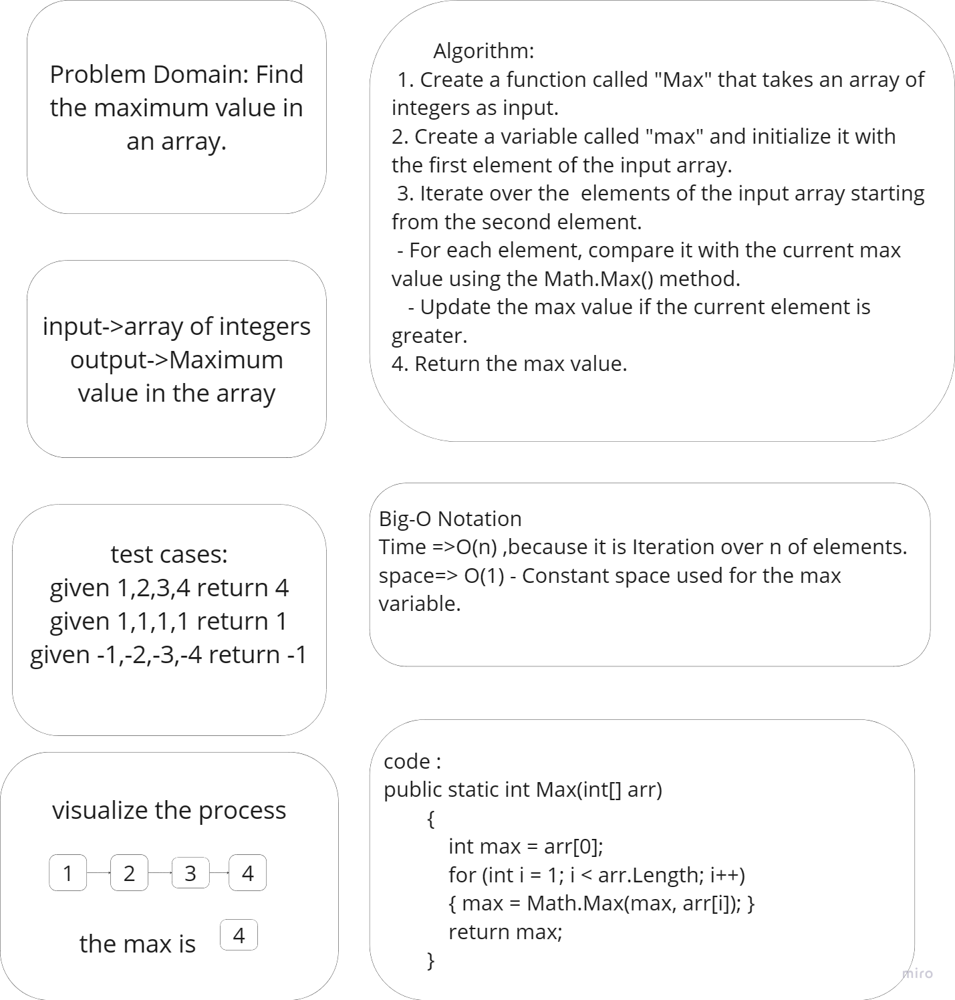

# Lab03
This project contains various challenges that involve solving different problems using C# programming.

## Functions:

1. **Multiple3Numbers**: This function takes three numbers as input and returns their product.

2. **SetInputs and CalculateAvg**: This function prompts the user to enter a number between 2-10 and then sets that number of inputs. It calculates the average of the entered numbers.

3. **StarDraw**: This function draws a pyramid of stars with a given size.

4. **FindMaxFeq**: function finds the number that appears the most times in an integer array. If there are no duplicates, it returns the first number in the array.

5. **Max**: function finds the maximum value in an integer array.

6. **AddToWords and ReadWords**: functions allows adding words to a file called "words.txt" and then reads the words from the file.

7. **GetWordAndLength**: function takes a sentence as input and returns an array with each word and its corresponding length.

## WhiteBoard of Challenge 5

